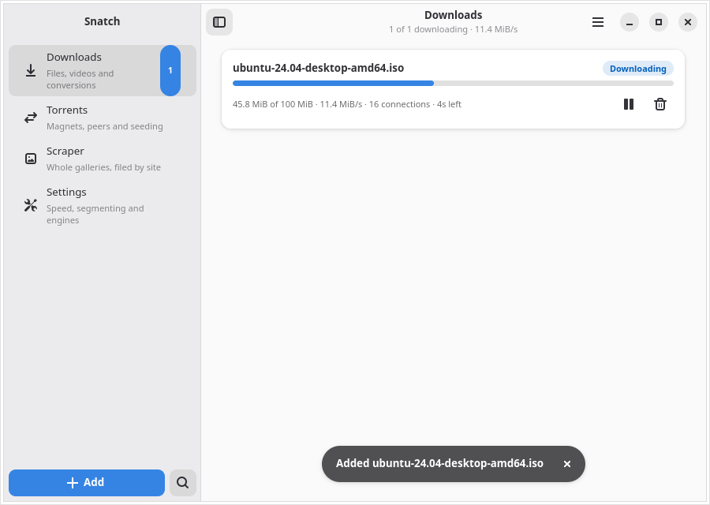
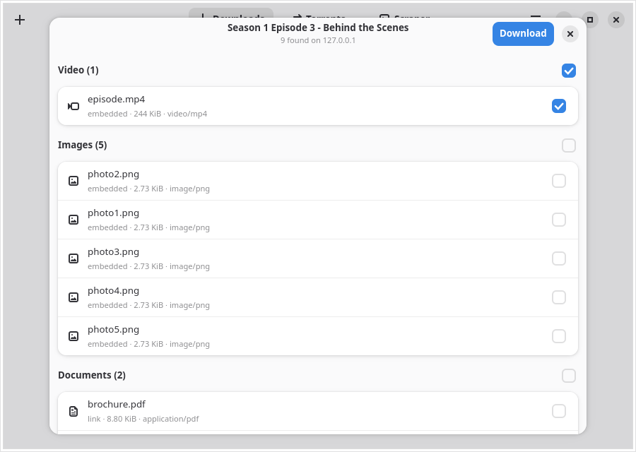
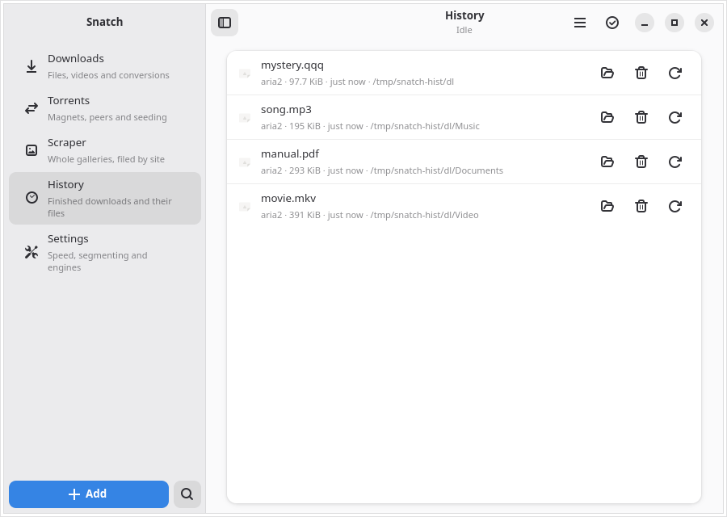
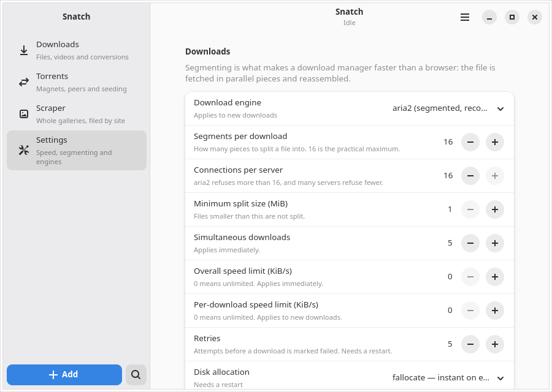

<div align="center">


# Snatch

**A download manager for Linux.**

</div>

Snatch downloads files fast. It splits each file into 16 parts and grabs them
at the same time. If your internet drops, it picks up where it left off.

It also does torrents, videos, and whole image galleries. All in one window.

A browser add-on catches your downloads. Click a link, and Snatch takes it
instead of your browser.

Point at any video and a **Download with Snatch** button appears on it. Click
the button and pick the size you want.



Give it a page. It finds every file on it. You pick what you want:



See everything you have downloaded, and what to do with it:



Change how it works:



---

## Install

Copy this. Paste it in a terminal. Press Enter.

```bash
curl -fsSL https://raw.githubusercontent.com/ayoubzulfiqar/snatch-dl/main/get.sh | sh
```

That is it. It works out which Linux you use. It picks the right package. It
checks the file is not broken. Then it installs Snatch and the tools it needs.

It will ask for your password once. That is `sudo`, because it installs for the
whole computer.

Want to change something?

| What | Command |
|---|---|
| Skip the extra tools | <code>curl -fsSL …/get.sh &vert; sh -s -- --no-extras</code> |
| Pick a version | <code>curl -fsSL …/get.sh &vert; sh -s -- --version 2.14.1</code> |
| Remove Snatch | <code>curl -fsSL …/get.sh &vert; sh -s -- --uninstall</code> |

Do not trust a script you have not read? Good. [Read it first](get.sh). It is
short and does nothing clever.

### Or grab a package

Every release has one for each kind of Linux:

```bash
sudo apt install ./snatch-dl_2.14.1-1_amd64.deb            # Debian, Ubuntu, Mint
sudo dnf install ./snatch-dl-2.14.1-1.x86_64.rpm           # Fedora, RHEL, openSUSE
sudo pacman -U ./snatch-dl-2.14.1-1-x86_64.pkg.tar.zst     # Arch, Manjaro
```

There is a `.tar.gz` for anything else.

### What you need

Snatch needs **GTK 4.12 or newer**. That means Fedora 39+, Ubuntu 24.04+,
Debian 13+, or any rolling release. Older ones cannot run it.

Only **aria2** is required. The packages install it for you.

Everything else is optional. Each one adds a feature:

| Tool | What you lose without it |
|---|---|
| `ffmpeg` | Converting and trimming files |
| `yt-dlp` | Downloading videos from sites |
| `gallery-dl` | Downloading image galleries |
| `wget2` | Grabbing a whole site |
| `7z` | Unpacking archives |

Torrents need nothing extra. That part is built in.

Missed some? Open **Menu → Dependencies…**. It shows every tool and what it
does. It installs `yt-dlp` and `gallery-dl` for you. For the rest it shows the
exact command to copy.

Snatch never runs `sudo` itself. A download manager that asks for your password
is one you should not trust.

---

## Add the browser extension

Snatch works on its own. But the extension is what makes a click in your
browser go to Snatch.

**There is nothing to set up.** The package already told your browser where
Snatch is. Just load the extension.

The extension comes with Snatch. It sits in `/usr/share/snatch-dl/extension`.
You can also download it from any release as a zip.

### Chrome, Chromium, Brave, Edge, Opera, Vivaldi

1. Open `chrome://extensions`
2. Turn on **Developer mode**. It is in the top right.
3. Click **Load unpacked**
4. Pick the folder `/usr/share/snatch-dl/extension`

Pick the **folder**. Not a file inside it.

> You have to use Developer mode. Chrome only takes packed extensions from its
> own store. There is no way around that unless Snatch goes on the store.

### Firefox

1. Open `about:debugging#/runtime/this-firefox`
2. Click **Load Temporary Add-on…**
3. Pick `/usr/share/snatch-dl/extension-firefox/manifest.json`

> **Firefox forgets it when you restart.** Firefox only keeps signed
> extensions, and only Mozilla can sign one. Until Snatch is signed, you load
> it again each time. Or use Firefox Developer Edition and set
> `xpinstall.signatures.required` to `false`.

### What it gives you

**A button on every video.**

Point at a video on any site. A small **Download with Snatch** button shows up
in the corner. Click it.

Snatch lists the sizes that video comes in — 2160p, 1080p, 720p, and so on. It
shows how big each one is. Pick one and it downloads. There is an **Audio only**
row too, if you just want the sound.

**Live streams work too.** So do sites Snatch has never heard of. If it cannot
name the sizes, it looks at what the player is loading and offers that instead.

- A **live stream** is recorded while you watch.
- A **plain video file** is downloaded the fast way, in 16 pieces, with resume.

Snatch tells them apart and picks the right one for you.

Streams come in sizes too. If the site offers 720p, 480p and 240p, you get all
three in the list. Pick the one you want.

**Want it later, or just a bit of it?** Click **Recording options** in the
list:

| Box | What it does |
|---|---|
| **Start at** | Waits until that time, then records. Great for a show that starts at 8. |
| **Record for** | Stops on its own after that many minutes. |

Leave them blank to start now and run until you press stop.

If the button says it found nothing, press play first and click it again.
Snatch can only see a stream once the player asks for it.

**Some videos are locked.** Big paid services lock their video with DRM. The
key stays inside your browser and never comes out. Snatch says so when it sees
one. No download tool can save those — not Snatch, and not any other.

Snatch only looks when you click the button. It does not read the pages you are
just visiting.

**Updated Snatch and the button stopped working?** It fixes itself. Pages that
were already open get a fresh button on their own. If one still says to reload,
reload it — that page was open across the update.

**Do not want the button on a site?** Click the **×** on it. It goes away on
that site and stays away. To bring it back everywhere, right-click the Snatch
icon in your toolbar and tick **Show the button on videos**. Untick that to
turn it off on every site at once.

Right-click anything in your browser:

- **Download with Snatch**
- **Extract video with Snatch**
- **Find all media on this page**
- **Scrape this page with Snatch**

Normal downloads get caught before your browser starts them. Your cookies go
with them. That is why files behind a login work.

Magnet links work too. Right-click one and pick **Download with Snatch** — it
goes to the torrent engine, not the downloader.

---

## What it can do

**Download a big file and walk away.**
Click a link in your browser. Snatch takes it. It pulls the file in 16 pieces
at once. If your internet drops, it carries on later.

**Get a video at the size you want.**
Point at the video. Click the button on it. Pick 1080p, or 480p, or just the
sound. Snatch fetches that one and joins the picture and the sound into a
single file.

**Record a live stream, and stop when you want.**
Point at the player. Click the button. Pick the quality. Snatch writes the show
to disk while it happens.

**You can pause it.** Press pause and Snatch stops recording. Press it again
and it starts again. Everything you kept ends up in one file.

What happens while you are paused is not saved. That is what pausing a live
show means — it keeps going without you.

Watching a video that is not live? Pausing there loses nothing. Snatch carries
on from the exact spot when you press play again.

Press stop and it asks what you want:

| Choice | What happens |
|---|---|
| **Keep Recording** | Nothing. Carry on. |
| **Stop and Save** | Finishes the file so it plays. Keeps everything so far. |
| **Stop and Convert to MP4** | The same, then repacks it as MP4. |

Snatch always closes the file properly. A recording you stop halfway still
opens and still plays.

**What kinds of stream work?**

| Kind | Written as | How |
|---|---|---|
| HLS | `.m3u8`, `.m3u` | Found on the page. Every quality is listed. |
| DASH | `.mpd` | Found on the page. |
| MPEG-TS | `.ts`, `.mts`, `.m2ts` | Found on the page when it is a whole show, not a piece of one. |
| Plain files | `.mp4`, `.mkv`, `.webm`, `.flv`, `.mov`, `.avi`, and more | Downloaded fast, in 16 pieces. |
| RTMP, RTSP, SRT, MMS, RTP, UDP | `rtmp://`, `rtsp://`, `srt://`, `mms://`, `rtp://`, `udp://` | Type it into **Add to Snatch** and pick **Record stream**. |

Your browser only ever sees web addresses, so the last row is for ones you type
in yourself. Old `mms://` addresses are fixed up for you.

Snatch checks every address before it offers it. If it cannot be read, it is
never put in the list.

**Record a row of channels in one go.**
Open **Add to Snatch**. Paste the addresses, one per line. Pick **Record
stream**. Set the time and the length once, and they apply to all of them.

Numbered addresses can be written once, the same as downloads:
`https://example.com/channel[1-6].m3u8` means six recordings.

Snatch records up to 16 at a time. Each one runs for as long as you leave it,
so it shows you the list and asks first.

**Watch a torrent while it downloads.**
Add a magnet link. Press the sequential button. The pieces arrive in order, so
you can open the file in a player before it is done.

**Get just the sound from a video.**
Press `Ctrl+D`. Paste the page. Choose **Audio only (MP3)**.

**Save a whole gallery.**
Right-click a page → **Scrape This Page**. Snatch follows the pages and finds
the full-size images behind the small ones.

**Take every file off a page.**
Press `Ctrl+F` and paste a link. Snatch reads the page and lists the images,
video, sound, documents and archives on it. Tick what you want.

**Download something behind a login.**
In your browser, right-click the request → **Copy as cURL**. Paste the whole
thing into Snatch. Your cookies come with it.

**Grab a numbered set of files.**
Type `photo[001-250].jpg`. That becomes 250 downloads. Snatch shows you the
list first, so you can check it.

**Know the file is not broken.**
Most sites publish a checksum next to a file. Snatch finds it and checks the
download against it. You do not have to do anything.

**Unpack archives on their own.**
Zip, 7z, rar and tar files unpack when they finish. Split sets wait for the
last part. Locked ones ask for the password.

**Start a download at 2am.**
Set a time when you add it. It waits in the queue until then.

**Or download all night.**
Set hours in Settings, like 01:00 to 08:00. Snatch pauses outside them. It can
suspend or shut down the computer when the queue empties. You get a minute to
stop it.

**Save a whole documentation site.**
Menu → **Grab a Site…**. Set how deep to go and which file types to keep.
Press **Check first** and Snatch shows you exactly what it would take, without
downloading any of it.

**Use one file from many mirrors.**
Paste several links. Tick **Treat multiple URLs as mirrors of one file**.
Snatch spreads the connections across all of them.

**Find last week's download.**
The History page lists everything. Each row opens the folder, deletes the file,
or downloads it again.

**Stop hunting through one huge folder.**
Files go into `Video`, `Music`, `Images`, `Documents`, `Compressed` and
`Programs` on their own. Turn it off if you want one flat folder.

**Send one download through a proxy.**
Add a proxy in **Proxy Settings**. Use it for everything, or pin it to one job.

**Catch links you copy.**
Turn on clipboard watching. Copy a file link and Snatch offers it. It is a
small pop-up, so it never steals your focus.

---

## Shortcuts

| Key | What it does |
|---|---|
| `Ctrl+N` | Add a download, magnet or gallery |
| `Ctrl+D` | Get a video |
| `Ctrl+F` | Find media on a page |
| `Ctrl+G` | Grab a whole site |
| `Ctrl+H` | History |
| `Ctrl+P` | Pause everything |
| `Ctrl+,` | Settings |
| `F9` | Show or hide the sidebar |
| `Ctrl+?` | This list |

---

## Settings

Snatch has five pages: **Downloads**, **Torrents**, **Scraper**, **History**
and **Settings**. Move between them in the sidebar. Press **F9** to show or
hide it. It stays how you leave it.

You can set your download folder here. Leave it blank to use your normal
Downloads folder.

Settings changes happen at different times. Each row tells you which:

| When | What |
|---|---|
| Right away | Downloads at once, speed limits, torrent upload limit, schedule, clipboard |
| Next download | Pieces per file, connections per server, per-file speed limit, engine |
| After restart | Disk space, retries, TLS checks, resume data, DHT, download folder |

### Those `.aria2` files

While a file downloads, you may see a `something.aria2` file next to it. That
file is how Snatch resumes after a crash. It goes away when the download ends.

Do not want them? Turn off **Write resume data while downloading** in Settings.
You lose crash resume.

---

## Proxies

The engines do not agree on proxies. Snatch tells you the truth instead of
guessing:

| Engine | HTTP proxy | SOCKS5 |
|---|---|---|
| aria2 (downloads) | yes | **no** |
| Torrents | **no** | yes |
| yt-dlp and gallery-dl | yes | yes |
| Snatch itself | yes | yes |

Give an aria2 download a SOCKS5 proxy and Snatch refuses. It says why. It will
not connect straight out behind your back. That is the one mistake a proxy user
cannot live with.

Two things to know:

- Torrents pick their proxy when Snatch starts. Change it and restart.
- With a SOCKS5 proxy, torrents stop taking incoming peers. An open port would
  show your real address.

---

## Where things go

```
/usr/bin/snatch-gui                     the app
/usr/bin/snatch-nmh                     the browser bridge
~/.local/share/snatch-dl/snatch.sock    the socket other programs use
~/.local/share/snatch-dl/snatch.sqlite  your download history
~/.local/share/snatch-dl/aria2.session  the queue, so it survives a restart
~/.local/share/snatch-dl/torrents/      torrent resume data
~/.local/share/snatch-dl/proxies.json   your proxies
```

Files go to your Downloads folder. Galleries go to `Snatch Galleries/`. Videos
go to `Snatch Video/`. Whole sites go to `Sites/`.

---

## Use it from the terminal

Snatch listens on a socket. Any program can send it a job.

```bash
SOCK=~/.local/share/snatch-dl/snatch.sock

# A normal download
printf '{"url":"https://example.com/file.iso"}\n' | nc -U "$SOCK"

# A magnet link
printf '{"url":"magnet:?xt=urn:btih:..."}\n' | nc -U "$SOCK"

# A video
printf '{"kind":"video","url":"https://example.com/watch?v=..."}\n' | nc -U "$SOCK"

# A gallery
printf '{"kind":"scrape","url":"https://example.com/user/gallery"}\n' | nc -U "$SOCK"
```

You get one line back: `{"ok":true,"gid":"..."}` or
`{"ok":false,"error":"..."}`. Snatch starts itself if it is not running.

---

## How it is built

Snatch does not download anything itself. It drives tools that are already
good at it.

| Job | Tool | Why |
|---|---|---|
| Files | **aria2** | 16 pieces at once, resume, good retries |
| Torrents | **librqbit** | DHT, peer exchange, play while downloading |
| Site video | **yt-dlp** | Knows thousands of sites |
| Live and odd streams | **ffmpeg** | Reads what the player reads |
| Galleries | **gallery-dl** | Knows hundreds of gallery sites |
| Converting | **ffmpeg** | The standard tool for it |
| Whole sites | **Wget2** | Follows links and filters what it keeps |
| Unpacking | **7-Zip** | Handles zip, 7z, rar and tar |

```
  browser add-on  ──▶  snatch-nmh  ──▶  snatch-gui
                                            │
                            ┌───────────────┴────────────────┐
                            │  window (GTK)   engines (Tokio) │
                            └────────────────────────────────┘
```

The window and the engines run apart. That is why the window never freezes
while four downloads are going.

Reading the source? [CONTRIBUTING.md](CONTRIBUTING.md) explains the parts
that look wrong but are not.

---

## Help and bugs

Found a bug? [Open an issue](https://github.com/ayoubzulfiqar/snatch-dl/issues/new/choose).

Want a feature? [Ask for it.](https://github.com/ayoubzulfiqar/snatch-dl/issues/new/choose)

Found a security hole? Read [SECURITY.md](SECURITY.md) first. Please do not
open a public issue for that one.

**Snatch does not take pull requests.** One person maintains it, so they are
closed unread. Open an issue instead — and if you already have a fix, paste it
in. It will get used and you will be credited. See
[CONTRIBUTING.md](CONTRIBUTING.md).

Be kind to people here: [CODE_OF_CONDUCT.md](CODE_OF_CONDUCT.md).

---

## Author

Made by **[Ayoub Zulfiqar](https://ayoubzulfiqar.com/)**.

More of my work: [ayoubzulfiqar.com/projects](https://ayoubzulfiqar.com/projects)

---

## License

See [LICENSE](LICENSE).

Snatch runs aria2, ffmpeg, yt-dlp, gallery-dl, Wget2 and 7-Zip as separate
programs. It does not include their code. Each keeps its own license.
